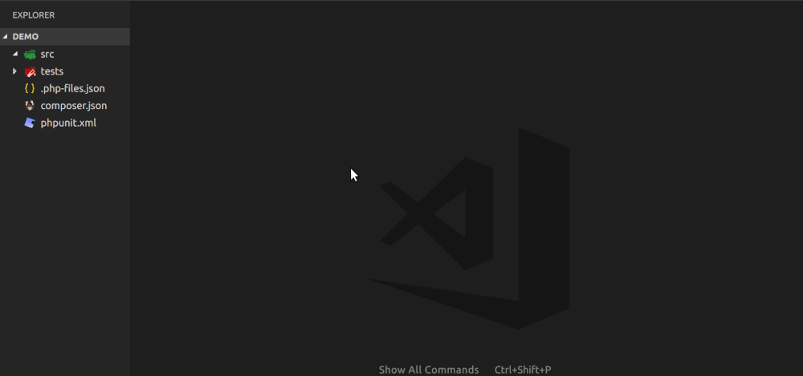
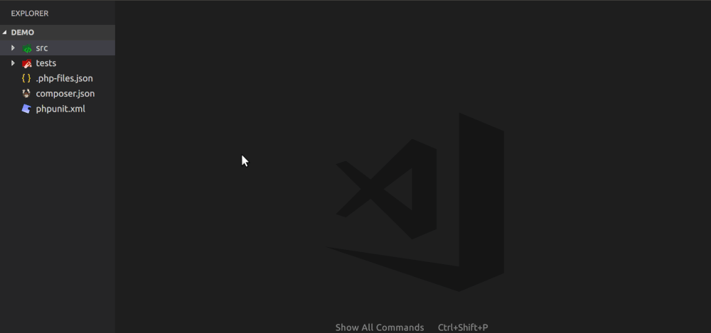
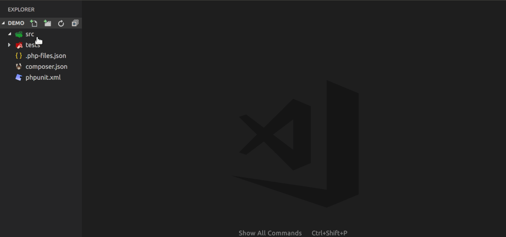

# PHP Files

Extension that adds naive IDE-like file creation.

**!IMPORTANT!** For now tested only under *nix. 

## A Story Behind

I like using [Visual Studio Code](https://code.visualstudio.com/).
But I was not satisfied with the process of creating PHP files. It always involves at least two steps: creation of the file and creation of the content.
Even if you use snippets or templates you have to provide name twice. Even further, if you follow [PSR-4](http://www.php-fig.org/psr/psr-4/) (and nowadays you should try to always follow it) you have to add namespace yourself.

## Features

### Automatic Namespace Resolution

For now this feature is available to you if you place `.php-files.json` to the root of your project:

```json
{
    "namespaces": {
        "Foo": "src"
    }
}
```

I'm going to provide the ability to retrieve namespaces from `composer.json`.

### Files creation

For now you have the following options for creating files from Explorer context menu:

#### New PHP Class

1. Select `New PHP Class` from the context menu inside Explorer.
2. Enter full _PHP Class_ name (e.g. 'Foo\Bar\Baz') and press enter to proceed or enter escape to discard.
3. Enter parent _PHP Class_ name. You can leave it empty and press enter to proceed to the implements,
or short-exit with escape to create class without extends or implements.
4. Enter _PHP Interfaces_ names (can be separated by comma).



#### New PHP Interface

1. Select `New PHP Interface` from the context menu inside Explorer.
2. Enter full _PHP Interface_ name (e.g. 'Foo\Bar\Baz') and press enter to proceed or enter escape to discard.
3. Enter _PHP Interfaces_ names (can be separated by comma).



#### New PHP Trait

1. Select `New PHP Trait` from the context menu inside Explorer.
2. Enter full _PHP Trait_ name (e.g. 'Foo\Bar\Baz') and press enter to proceed or enter escape to discard.



## Extension Settings

This extension contributes the following settings:

```json
// Template for PHP Class
"php-files.templates.PHPClass": [
    "<?php",
    "class PHPClass",
    "{",
    "}"
],

// Template for PHP Interface
"php-files.templates.PHPInterface": [
    "<?php",
    "interface PHPInterface",
    "{",
    "}"
],

// Template for PHP Trait
"php-files.templates.PHPTrait": [
    "<?php",
    "trait PHPTrait",
    "{",
    "}"
],
```

## Known Issues

When you create new files a bunch of new lines created in the end of it.
I will investigate this. As a temporary solution you can set file of the vscode itself to remove them on save settings:

```json

"files.insertFinalNewline": true,
"files.trimFinalNewlines": true,

```

## TODO

- Allow using of commands from the command palette.
- Implement tests.
- Implement `PHP File Rename`
- Implement `PHP File Duplicate`

## Acknowledgments

All the hardcore PHP AST staff is done by [php_writer](https://github.com/glayzzle/php-writer), which itself uses following great libraries:

- [php-parser](https://github.com/glayzzle/php-parser)

- [php-unparser](https://github.com/chris-l/php-unparser)

I cannot thank the creators and contributers of those packages enough!
